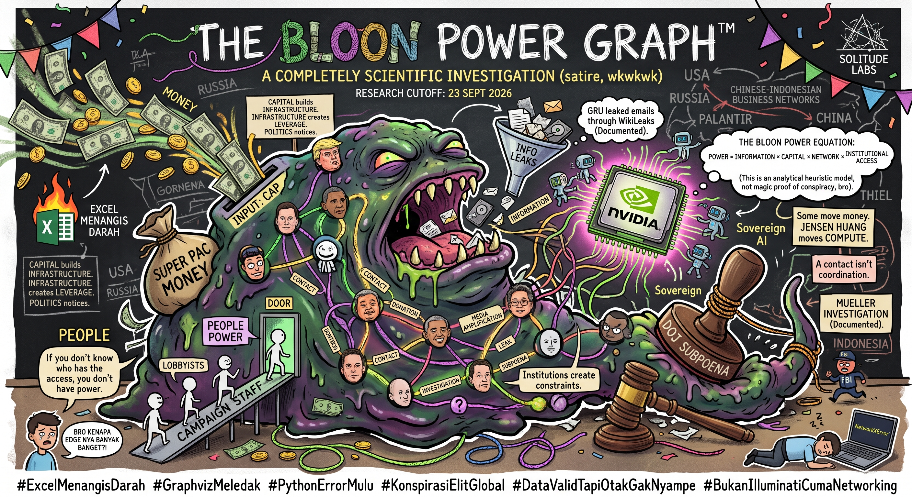

# THE BLOON POWER GRAPH™

**Information, Money, People & Institutional Power — mapped BLOON-style.**

A reproducible network-analysis toy model where **Centrality ≠ Conspiracy** and **Correlation ≠ Causation**.



## What is this?

A BLOON-style experiment that represents political, institutional, financial, informational, and people-to-people relationships as a graph.

Core heuristic:

`POWER = INFORMATION × CAPITAL × NETWORK × INSTITUTIONAL ACCESS`

This is a **conceptual/heuristic model**, not an empirical law, objective political-power score, or proof of conspiracy.

## Repository status

**v0.1 seed / prototype**

The supplied Python program currently loads:

- `nodes.csv`
- `edges.csv`

A temporal dataset is included as:

- `temporal_edges.csv`

but the current Python script does **not** yet use the temporal file in its calculations.

See [`PUBLISH_QA.md`](PUBLISH_QA.md) for the pre-publication audit.

## Run

```bash
pip install -r requirements.txt
python bloon_computational_model.py
```

## Dataset

Current seed dataset:

- 30 nodes
- 23 static edges
- 7 temporal edges

## BLOON warning

A graph can reveal structure.

A graph cannot magically reveal intent.

A contact ≠ coordination.

A donation ≠ control.

A contract ≠ political capture.

Centrality ≠ guilt.

Centrality ≠ causality.

## Research cutoff

**23 September 2026**

## Planned v0.2

- source ledger
- URL-level provenance
- temporal graph support
- MultiDiGraph / edge IDs
- evidence strength separated from graph distance
- explicit Information / Capital / People / Institutional coding
- reproducible Graphviz exports
